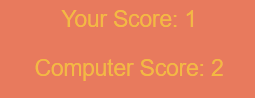
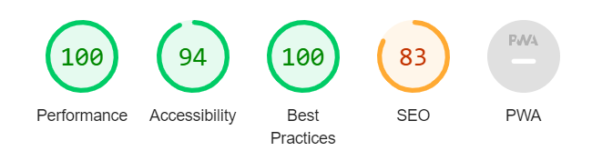

nt to try your luck on a classic game of "Rock, Paper, Scissors? Or do you belive that the game can be won with skills? Come and try this fun game and se who comes out as the winner in best out of 5 tries. Play on your phone, tablet or computer and share it with your friends and family. 

This game is fun for everyone with a couple of minutes to spare. See if you can beat the computer and be victorius in this simple but fun online game. The game is fully responsive and a good demonstration of basic JavaScript code. 

  

## Features
---------------

The features included on the page are essential to a attractive website that is both fun and inviting.

- Feature 1: Title

To easily aid the website user the title is located on the middle of the screen. In its simplistic way it tells the user what the game is about. 

 

- Feature 2: Options
  
  The options section of the website is intended to show the user which buttons are part of the game. With the titles of "Rock", "Paper" and "Scissors" it quicly becomes clear what the game is about and how to proceed. 

  

  - Feature 3: Result

The result section of the website shows the end result of the game and the current round. The game is played best out of 5. In big and clear text the result section is intended to inform and excite the player.  

 

 - Feature 4: Score

The score section displays the score between the player and the computer. It updates when an option has been choosen and helps the player to keep score.  

- Feature 4: Reload 

The reload button gives the player the possibility to reload the game without having to refresh the page. It challenge the player to play another round with the text "Try Again?".  

## Testing 
---------------

To test the functionality of the website I have tested the options buttons and played the game multiple times. The result section clearly shows the current result. 

The score section is divided in to two parts. The players score and the computers. When a option has been choosen the score section updates like it should and lets the player know the current score. 

The reload button is located at the bottom of the page and is not visible while playing. It accurately appears when 5 rounds are done and the game is finished. It has the text "Try Again?" to invite the player for another game without having to reload the page. When clicked the reload button starts a new game.  

To check the responsiveness I ran the site threw https://amiresponsive.co.uk/. Before that I tried with media queries in the CSS file to make the site responsive on small screen-sizes. However when choosing screen-sizes up to 500px I noticed that it made no difference. I believe its due to the size of the game and its functions. 

All code in this project was run through Microsoft Visual Studio Code before implemented into Codeanywhere. 

### Validator Testing 

- HTML
    - No errors were returned when passing through the official [W3C validator](https://validator.w3.org/nu/?doc=https%3A%2F%2Fcode-institute-org.github.io%2Flove-maths%2F#textarea)
- CSS
    - No errors were found when passing through the official [(Jigsaw) validator](http://jigsaw.w3.org/css-validator/validator$link)
- JavaScript
    - No errors were found when passing through the official [Jshint validator](https://jshint.com/)
      - The following metrics were returned: 
      - There are 11 functions in this file.
      - Function with the largest signature take 2 arguments, while the median is 0.
      - Largest function has 10 statements in it, while the median is 1.
      - The most complex function has a cyclomatic complexity value of 8 while the median is 1.

### Unfixed Bugs

No unfixed bugs.

## Deployment

 

- The site was deployed to GitHub pages. The steps to deploy are as follows: 
  - In the GitHub repository, navigate to the Settings tab 
  - From the source section drop-down menu, select the Main Branch
  - Once the master branch has been selected, the page will be automatically refreshed with a detailed ribbon display to indicate the successful deployment. 

The live link can be found here - <https://renwar-p.github.io/rps-game/>

## Credits

- Content
  
  - The fonts used in this project are Arial, sans-serif. 

  - The color combinations used in this project is titled "Prussian blue, orange and mustars" and came from <https://looka.com/blog/color-combinations/> I choose these colors because i felt that they would work well with the overall spirit of the game. 
  - The inspiration behind the HTML structure of this website comes from the structure provided in the "Portfolio Project Scope" video. 
  - The inspiration and overall JavaScipt structure behind the "Rock, Paper, Scissor" game comes from the site <https://www.codewithfaraz.com/content/107/create-rock-paper-scissors-game-with-html-css-and-javascript#javascript-code> However there are some differences in the JavaScript structure. 
- 1. In my game I choose not to have a countdown timer. 
- 2. My game has a total of 5 rounds. The "codewithfaraz" game played it until someone reached 5 wins. How to make this shift, I got the code from <https://stackoverflow.com/questions/73178661/rock-paper-scissors-5-round-logic>. 
- 3. The "codewithfaraz" game handles the player's choice by registering the selectWeapon function on click events of the .choice elements. My game instead handles the player's choice by registering the game logic within a playRound function, which is called when the player clicks a button. How to write it within a another function with the same if and else if is taken from the "codewithfaraz" games updateScore function. 
- 4. The "codewithfaraz" game displays the result in a single element with class #result.
In my game the result is displayed in a separate element with class .result.
- 5. The "codewithfaraz" game has a "Play Again" button visible at all time. My game has a hidden reload button. It appears first when the five rounds are over. The code on how to achieve this I got from <https://stackoverflow.com/questions/8685107/hiding-a-button-in-javascript>.

